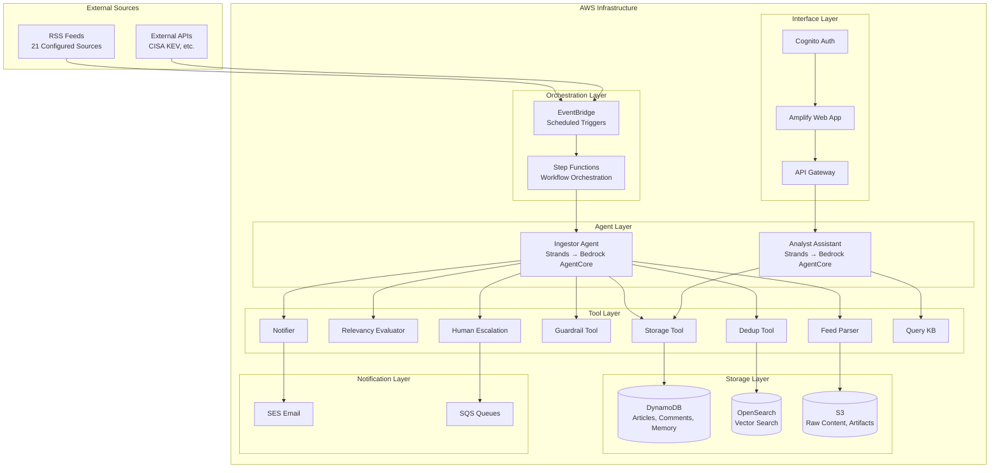
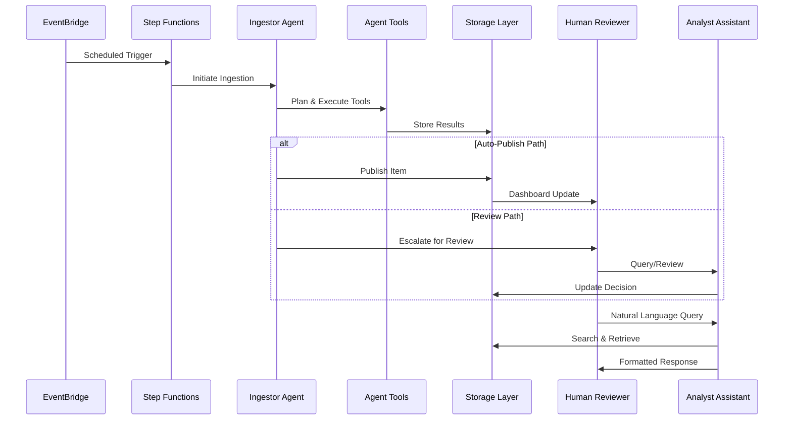
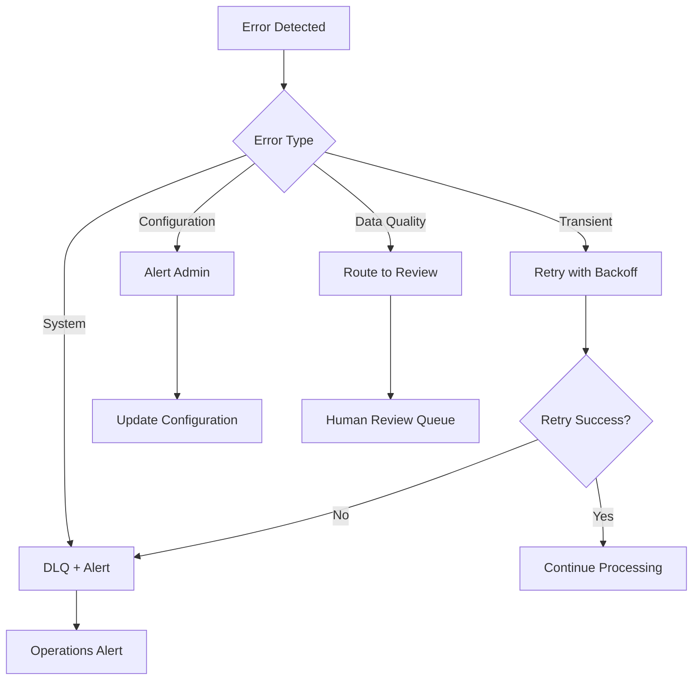
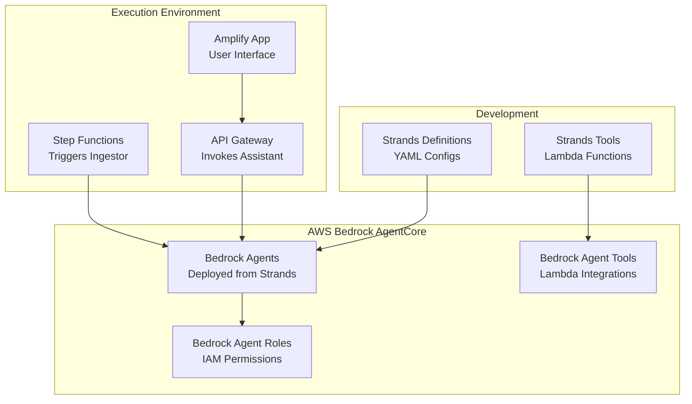
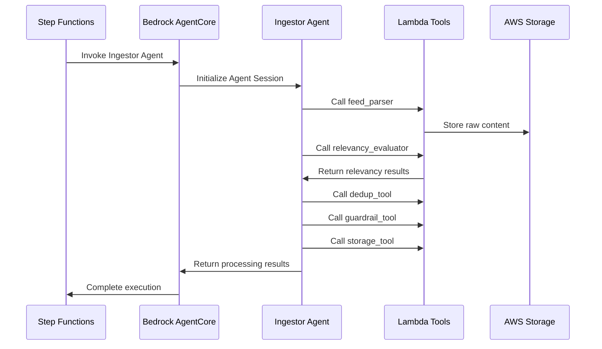
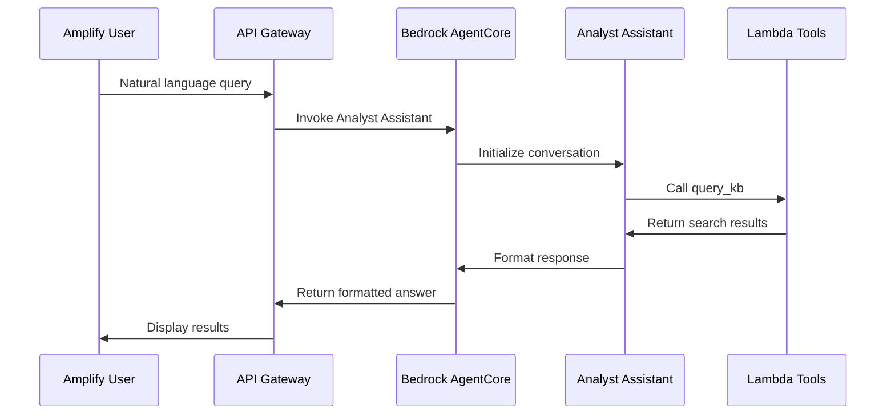

# Design Document

## Overview

Sentinel is a sophisticated AWS-native cybersecurity intelligence platform that leverages multi-agent architecture to autonomously process, analyze, and publish cybersecurity news from 21+ RSS feeds. The system employs advanced AI agents for content triage, deduplication, and keyword-based relevance assessment, while maintaining human oversight through intelligent escalation workflows.

The platform is designed around two primary AI agents built using Strands and deployed to AWS Bedrock AgentCore:
- **Ingestor Agent**: Autonomous planner/actor responsible for content ingestion, analysis, and triage
- **Analyst Assistant Agent**: Interactive assistant for natural language queries and human collaboration

## Architecture

### High-Level Architecture



### Agent Architecture

The system employs a multi-agent architecture using Strands for agent orchestration and AWS Bedrock AgentCore for deployment and execution:

#### Strands Integration
- **Purpose**: Higher-level agentic orchestration layer for managing agent lifecycles, tool coordination, and inter-agent communication
- **Benefits**: Simplified agent development, built-in observability, standardized tool interfaces
- **Deployment**: Agents created in Strands are deployed to AWS Bedrock AgentCore for scalable execution

#### Ingestor Agent (Strands → Bedrock AgentCore)
- **Role**: Autonomous content processing and triage
- **Capabilities**: Planning, tool use, reflection, guardrail enforcement
- **Tools**: FeedParser, RelevancyEvaluator, DedupTool, GuardrailTool, StorageTool, HumanEscalation, Notifier
- **Decision Framework**: ReAct pattern with reflection checkpoints
- **Deployment**: Strands agent definition deployed to Bedrock AgentCore with associated Lambda tools
- **Execution**: Triggered by Step Functions, executes autonomously with tool access

#### Analyst Assistant Agent (Strands → Bedrock AgentCore)
- **Role**: Interactive human collaboration and query processing
- **Capabilities**: Natural language understanding, knowledge base querying, report generation
- **Tools**: QueryKB, GetDuplicates, GetEscalations, PublishDecision, CommentaryAPI, AlertStatus
- **Interaction Model**: Conversational with context retention
- **Deployment**: Strands agent definition deployed to Bedrock AgentCore with API Gateway integration
- **Execution**: Invoked via Amplify app through API Gateway, maintains session context

### Data Flow Architecture



## Components and Interfaces

### Core Components

#### 1. Feed Configuration Manager
**Purpose**: Centralized management of RSS feeds and target keywords

**Configuration Schema**:
```json
{
  "feeds": [
    {
      "name": "ANSSI Avis",
      "url": "https://www.cert.ssi.gouv.fr/avis/feed/",
      "category": "Advisories",
      "enabled": true,
      "fetch_interval": "1h"
    }
  ],
  "keywords": {
    "cloud_platforms": ["Azure", "Entra", "Microsoft 365", "AWS", "Google Workspace"],
    "security_vendors": ["Mimecast", "Fortinet", "CloudFlare", "DarkTrace", "SentinelOne"],
    "enterprise_tools": ["Jamf Pro", "Tenable", "CyberArk", "Checkpoint Firewall"]
  }
}
```

#### 2. Content Ingestion Pipeline
**Components**:
- **Feed Parser**: Handles RSS/Atom parsing with error handling and normalization
- **Content Normalizer**: Converts HTML to clean text, extracts metadata
- **Storage Manager**: Manages S3 uploads and DynamoDB records

**Interface**:
```python
class FeedParser:
    def parse_feed(self, feed_config: FeedConfig) -> List[Article]:
        """Parse RSS feed and return normalized articles"""
        
    def normalize_content(self, raw_html: str) -> NormalizedContent:
        """Convert HTML to clean text with metadata"""
```

#### 3. Relevancy and Keyword Engine
**Purpose**: LLM-powered relevance assessment with keyword targeting

**Keyword Matching Strategy**:
- Exact string matching for product names
- Fuzzy matching for variations and abbreviations  
- Context-aware matching to avoid false positives
- Weighted scoring based on keyword importance

**Interface**:
```python
class RelevancyEvaluator:
    def evaluate_relevance(self, content: str, keywords: List[str]) -> RelevanceResult:
        """Assess content relevance and extract keyword matches"""
        
    def extract_entities(self, content: str) -> EntityExtractionResult:
        """Extract structured entities (CVEs, actors, etc.)"""
```

#### 4. Deduplication Engine
**Strategy**: Multi-layered approach combining heuristic and semantic methods

**Heuristic Deduplication**:
- Canonical URL comparison
- Normalized title similarity (Levenshtein distance)
- Source domain clustering
- Publication time proximity

**Semantic Deduplication**:
- Bedrock embeddings for content vectorization
- OpenSearch k-NN for similarity search
- MinHash/SimHash for scalable near-duplicate detection
- Configurable similarity thresholds

**Interface**:
```python
class DedupTool:
    def find_duplicates(self, article: Article) -> DuplicationResult:
        """Identify duplicates using multi-layered approach"""
        
    def cluster_articles(self, articles: List[Article]) -> List[Cluster]:
        """Group related articles into clusters"""
```

#### 5. Guardrail System
**Purpose**: Multi-layered content validation and safety checks

**Validation Layers**:
1. **Schema Validation**: JSON structure compliance
2. **Entity Validation**: CVE format verification, NVD cross-reference
3. **Content Safety**: PII detection, sensitive data redaction
4. **Quality Assurance**: Bias detection, sensationalism filtering
5. **Hallucination Detection**: Fact verification against known databases

**Interface**:
```python
class GuardrailTool:
    def validate_content(self, article: ProcessedArticle) -> GuardrailResult:
        """Comprehensive content validation"""
        
    def detect_pii(self, content: str) -> PIIDetectionResult:
        """Identify and flag personally identifiable information"""
```

#### 6. Triage Decision Engine
**Decision Matrix**:

| Relevancy Score | Keyword Matches | Guardrail Status | Duplicate Status | Action |
|----------------|-----------------|------------------|------------------|---------|
| > 0.8 | ≥ 1 | Pass | Not Duplicate | AUTO_PUBLISH |
| 0.6-0.8 | ≥ 1 | Pass | Not Duplicate | REVIEW |
| > 0.8 | 0 | Pass | Not Duplicate | REVIEW |
| < 0.6 | Any | Any | Any | DROP |
| Any | Any | Fail | Any | REVIEW |
| Any | Any | Any | Duplicate | DROP |

#### 7. Human-in-the-Loop Interface
**Components**:
- **Review Queue**: Prioritized list of items requiring human attention
- **Decision Interface**: Approve/reject with editing capabilities
- **Commentary System**: Threaded discussions per article
- **Feedback Collection**: Thumbs up/down with improvement suggestions

### Strands Agent Definitions

#### Ingestor Agent Strands Configuration
```yaml
name: sentinel-ingestor-agent
description: "Autonomous cybersecurity news ingestion and triage agent"
model: "anthropic.claude-3-5-sonnet-20241022-v2:0"
instructions: |
  You are a cybersecurity intelligence analyst responsible for processing news feeds.
  Your role is to ingest, analyze, deduplicate, and triage cybersecurity articles.
  Use the available tools to process content systematically and make informed decisions.
  Always apply guardrails and escalate uncertain cases to human review.
  
tools:
  - name: feed_parser
    lambda_arn: "arn:aws:lambda:region:account:function:sentinel-feed-parser"
  - name: relevancy_evaluator  
    lambda_arn: "arn:aws:lambda:region:account:function:sentinel-relevancy-evaluator"
  - name: dedup_tool
    lambda_arn: "arn:aws:lambda:region:account:function:sentinel-dedup-tool"
  - name: guardrail_tool
    lambda_arn: "arn:aws:lambda:region:account:function:sentinel-guardrail-tool"
  - name: storage_tool
    lambda_arn: "arn:aws:lambda:region:account:function:sentinel-storage-tool"
  - name: human_escalation
    lambda_arn: "arn:aws:lambda:region:account:function:sentinel-human-escalation"
  - name: notifier
    lambda_arn: "arn:aws:lambda:region:account:function:sentinel-notifier"

deployment:
  target: "bedrock-agentcore"
  execution_role: "arn:aws:iam::account:role/SentinelIngestorAgentRole"
```

#### Analyst Assistant Agent Strands Configuration
```yaml
name: sentinel-analyst-assistant
description: "Interactive cybersecurity intelligence assistant for analysts"
model: "anthropic.claude-3-5-sonnet-20241022-v2:0"
instructions: |
  You are a helpful cybersecurity analyst assistant. Help users query the intelligence
  database, generate reports, and provide insights on cybersecurity trends.
  Always cite sources and provide actionable information.
  
tools:
  - name: query_kb
    lambda_arn: "arn:aws:lambda:region:account:function:sentinel-query-kb"
  - name: get_duplicates
    lambda_arn: "arn:aws:lambda:region:account:function:sentinel-get-duplicates"
  - name: get_escalations
    lambda_arn: "arn:aws:lambda:region:account:function:sentinel-get-escalations"
  - name: publish_decision
    lambda_arn: "arn:aws:lambda:region:account:function:sentinel-publish-decision"
  - name: commentary_api
    lambda_arn: "arn:aws:lambda:region:account:function:sentinel-commentary-api"
  - name: alert_status
    lambda_arn: "arn:aws:lambda:region:account:function:sentinel-alert-status"

deployment:
  target: "bedrock-agentcore"
  execution_role: "arn:aws:iam::account:role/SentinelAnalystAssistantRole"
  api_integration: true
```

### Agent Tool Interfaces

#### Lambda Tool Specifications (for Bedrock AgentCore)

**FeedParser Tool**:
```json
{
  "name": "feed_parse",
  "description": "Parse RSS feed and extract articles",
  "parameters": {
    "feed_id": "string",
    "since": "datetime (optional)"
  },
  "returns": {
    "items": [
      {
        "url": "string",
        "title": "string", 
        "published_at": "datetime",
        "raw_html_s3": "string",
        "content_hash": "string"
      }
    ]
  }
}
```

**RelevancyEvaluator Tool**:
```json
{
  "name": "evaluate_relevance",
  "description": "Assess content relevance and extract entities",
  "parameters": {
    "article_id": "string",
    "content": "string",
    "target_keywords": ["string"]
  },
  "returns": {
    "is_relevant": "boolean",
    "relevancy_score": "float",
    "keyword_matches": [
      {
        "keyword": "string",
        "hit_count": "integer",
        "context": ["string"]
      }
    ],
    "entities": {
      "cves": ["string"],
      "threat_actors": ["string"],
      "malware": ["string"],
      "vendors": ["string"],
      "products": ["string"]
    },
    "rationale": "string"
  }
}
```

**QueryKB Tool**:
```json
{
  "name": "query_knowledge_base",
  "description": "Search articles with natural language queries",
  "parameters": {
    "query": "string",
    "filters": {
      "date_range": {"start": "datetime", "end": "datetime"},
      "keywords": ["string"],
      "categories": ["string"],
      "sources": ["string"]
    },
    "export_format": "string (optional: xlsx, json)"
  },
  "returns": {
    "articles": [
      {
        "title": "string",
        "url": "string",
        "published_at": "datetime",
        "keyword_matches": ["string"],
        "hit_count": "integer",
        "description": "string"
      }
    ],
    "export_url": "string (if export requested)"
  }
}
```

## Data Models

### DynamoDB Schema Design

#### Articles Table
```json
{
  "TableName": "sentinel-articles",
  "KeySchema": [
    {"AttributeName": "article_id", "KeyType": "HASH"}
  ],
  "AttributeDefinitions": [
    {"AttributeName": "article_id", "AttributeType": "S"},
    {"AttributeName": "state", "AttributeType": "S"},
    {"AttributeName": "published_at", "AttributeType": "S"},
    {"AttributeName": "cluster_id", "AttributeType": "S"}
  ],
  "GlobalSecondaryIndexes": [
    {
      "IndexName": "state-published_at-index",
      "KeySchema": [
        {"AttributeName": "state", "KeyType": "HASH"},
        {"AttributeName": "published_at", "KeyType": "RANGE"}
      ]
    },
    {
      "IndexName": "cluster-published_at-index", 
      "KeySchema": [
        {"AttributeName": "cluster_id", "KeyType": "HASH"},
        {"AttributeName": "published_at", "KeyType": "RANGE"}
      ]
    }
  ]
}
```

**Article Item Structure**:
```json
{
  "article_id": "uuid",
  "source": "string",
  "feed_id": "string", 
  "url": "string",
  "canonical_url": "string",
  "title": "string",
  "published_at": "ISO8601",
  "ingested_at": "ISO8601",
  "state": "INGESTED|PROCESSED|PUBLISHED|ARCHIVED|REVIEW",
  "cluster_id": "string",
  "is_duplicate": "boolean",
  "duplicate_of": "string (article_id)",
  "relevancy_score": "number",
  "keyword_matches": [
    {
      "keyword": "string",
      "hit_count": "number",
      "contexts": ["string"]
    }
  ],
  "triage_action": "AUTO_PUBLISH|REVIEW|DROP",
  "summary_short": "string",
  "summary_card": "string", 
  "entities": {
    "cves": ["string"],
    "threat_actors": ["string"],
    "malware": ["string"],
    "vendors": ["string"],
    "products": ["string"],
    "sectors": ["string"],
    "countries": ["string"]
  },
  "tags": ["string"],
  "confidence": "number",
  "guardrail_flags": ["string"],
  "trace_s3_uri": "string",
  "raw_s3_uri": "string",
  "normalized_s3_uri": "string",
  "created_by_agent_version": "string"
}
```

### OpenSearch Index Design

#### Articles Text Index (BM25)
```json
{
  "mappings": {
    "properties": {
      "article_id": {"type": "keyword"},
      "title": {"type": "text", "analyzer": "standard"},
      "content": {"type": "text", "analyzer": "standard"},
      "keywords": {"type": "keyword"},
      "published_at": {"type": "date"},
      "source": {"type": "keyword"},
      "tags": {"type": "keyword"}
    }
  }
}
```

#### Articles Vector Index (k-NN)
```json
{
  "mappings": {
    "properties": {
      "article_id": {"type": "keyword"},
      "embedding": {
        "type": "knn_vector",
        "dimension": 1536,
        "method": {
          "name": "hnsw",
          "space_type": "cosinesimil"
        }
      },
      "published_at": {"type": "date"},
      "source": {"type": "keyword"},
      "tags": {"type": "keyword"}
    }
  }
}
```

## Error Handling

### Failure Scenarios and Recovery

#### 1. Feed Ingestion Failures
**Scenarios**:
- Network timeouts
- Invalid RSS format
- Authentication failures
- Rate limiting

**Recovery Strategy**:
- Exponential backoff with jitter
- Circuit breaker pattern
- Dead letter queue for persistent failures
- Alternative feed sources when available

#### 2. LLM Processing Failures
**Scenarios**:
- Model unavailability
- Token limit exceeded
- Invalid response format
- Hallucination detection

**Recovery Strategy**:
- Fallback to simpler heuristic methods
- Request chunking for large content
- Schema validation with retry
- Human escalation for quality issues

#### 3. Storage Failures
**Scenarios**:
- DynamoDB throttling
- S3 upload failures
- OpenSearch indexing errors

**Recovery Strategy**:
- Automatic retry with exponential backoff
- Batch processing optimization
- Alternative storage paths
- Data consistency checks

### Error Classification and Routing



## Strands to Bedrock AgentCore Deployment

### Deployment Architecture



### Deployment Process

#### 1. Infrastructure-First Deployment with Terraform
```bash
# Initialize Terraform with remote state
cd infra/envs/dev
terraform init

# Plan complete infrastructure deployment
terraform plan -var-file="terraform.tfvars"

# Deploy entire stack in one apply
terraform apply -var-file="terraform.tfvars"

# Verify all resources are created
terraform output
```

#### 2. Agent Deferral Strategy
```bash
# Initial deployment with direct Lambda orchestration
terraform apply -var="enable_agents=false"

# Later, enable AgentCore integration
terraform apply -var="enable_agents=true"

# Deploy agents to Bedrock AgentCore (when ready)
strands deploy --target bedrock-agentcore --environment production
```

#### 3. Configuration Management
- **RSS Feeds**: Update `config/feeds.json` with new sources
- **Keywords**: Modify `config/keywords.json` for target technologies
- **Email Recipients**: Configure SES identities in `config/notifications.json`
- **Feature Flags**: Toggle capabilities via SSM Parameter Store
- **Monitoring**: CloudWatch dashboards auto-created by Terraform

### Agent Execution Flow

#### Ingestor Agent Execution (Step Functions → Bedrock AgentCore)


#### Analyst Assistant Execution (API Gateway → Bedrock AgentCore)


### Benefits of Terraform + Agent Deferral Architecture

1. **Complete Infrastructure as Code**: Single terraform apply deploys entire stack
2. **Gradual Rollout**: Start with direct Lambda orchestration, add agents later
3. **Feature Flags**: Toggle capabilities without redeployment
4. **Cost Control**: Configurable resource limits and auto-scaling policies
5. **Security by Default**: Least-privilege IAM, VPC endpoints, encryption at rest
6. **Operational Excellence**: Built-in monitoring, alerting, and observability
7. **Maintainability**: Modular Terraform design for easy updates and scaling

### Configuration Management Locations

#### RSS Feed Configuration (`config/feeds.json`)
```json
{
  "feeds": [
    {
      "name": "ANSSI Avis",
      "url": "https://www.cert.ssi.gouv.fr/avis/feed/",
      "category": "Advisories",
      "enabled": true,
      "fetch_interval": "1h"
    }
  ]
}
```

#### Keyword Configuration (`config/keywords.json`)
```json
{
  "cloud_platforms": ["Azure", "Entra", "Microsoft 365", "AWS", "Google Workspace"],
  "security_vendors": ["Mimecast", "Fortinet", "CloudFlare", "DarkTrace", "SentinelOne"],
  "enterprise_tools": ["Jamf Pro", "Tenable", "CyberArk", "Checkpoint Firewall"]
}
```

#### Email Recipients (`config/notifications.json`)
```json
{
  "ses_identities": ["security-team@company.com", "analysts@company.com"],
  "notification_groups": {
    "escalations": ["senior-analyst@company.com"],
    "daily_digest": ["security-team@company.com"],
    "alerts": ["soc@company.com"]
  }
}
```

## Testing Strategy

### Unit Testing
**Coverage Areas**:
- Individual tool functions
- Data model validation
- Keyword matching algorithms
- Deduplication logic
- Guardrail validation

**Testing Framework**: pytest with mocking for AWS services

### Integration Testing
**Test Scenarios**:
- End-to-end feed processing
- Agent tool interactions
- Database consistency
- API endpoint functionality

**Environment**: Dedicated test AWS account with isolated resources

### Agent Testing
**Approach**: 
- Prompt engineering validation
- Tool call sequence verification
- Decision quality assessment
- A/B testing framework for prompt optimization

**Metrics**:
- Relevancy assessment accuracy
- Deduplication precision/recall
- Triage decision quality
- Response time performance

### Load Testing
**Scenarios**:
- High-volume feed ingestion
- Concurrent user queries
- Bulk report generation
- System resource utilization

**Tools**: Artillery.js for API load testing, custom scripts for feed simulation

### Security Testing
**Areas**:
- Authentication and authorization
- Input validation and sanitization
- PII detection accuracy
- Data encryption verification

**Approach**: Automated security scanning, penetration testing, compliance validation

This comprehensive design provides the foundation for implementing the Sentinel cybersecurity intelligence platform with all required capabilities including the specific RSS feeds and keyword targeting functionality.