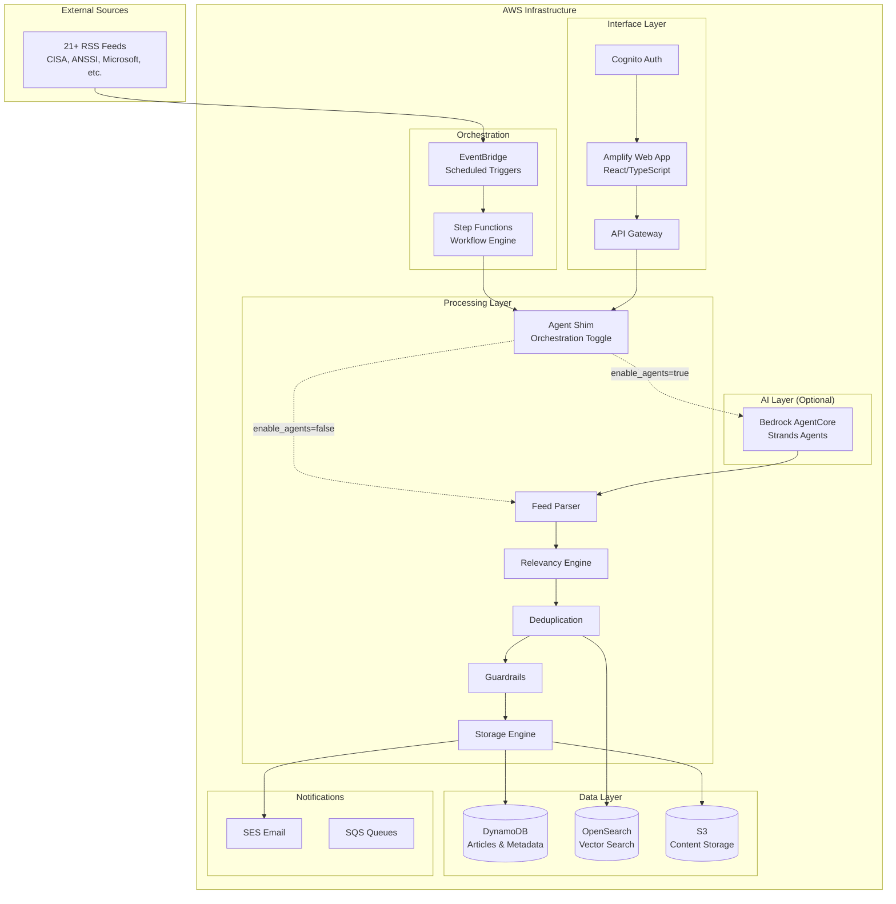

# Sentinel: AI-Powered Cybersecurity Intelligence Platform

## Problem Statement

Security analysts are overwhelmed by the volume of cybersecurity news and threat intelligence from multiple sources. Manual monitoring of 20+ RSS feeds, identifying relevant threats to specific technology stacks, and avoiding duplicate analysis creates significant operational overhead. Organizations need an automated system that can:

- **Ingest** cybersecurity news from multiple RSS feeds automatically
- **Filter** content for relevance to specific technology stacks and keywords
- **Deduplicate** similar articles across sources to reduce noise
- **Triage** content intelligently for auto-publication or human review
- **Alert** analysts to critical threats requiring immediate attention
- **Query** historical intelligence using natural language

## Solution Overview

Sentinel is an AWS-native, multi-agent cybersecurity intelligence platform that autonomously processes 21+ RSS feeds, extracts relevant threats, and publishes actionable intelligence. The system reduces analyst workload by 70%+ through intelligent automation while maintaining human oversight for critical decisions.

## Infrastructure Architecture



## Key Architectural Decisions

### 1. Agent Deferral Strategy
**Decision**: Deploy core functionality first, add AI agents later
**Rationale**: 
- Reduces deployment complexity and risk
- Validates business logic before adding agent orchestration
- Enables immediate value delivery
- Provides fallback option if agents encounter issues

**Implementation**:
- `enable_agents=false` (default): Step Functions → Lambda tools directly
- `enable_agents=true` (later): Step Functions → Bedrock AgentCore → Lambda tools
- Same tool contracts regardless of orchestration method

### 2. Terraform-First Infrastructure
**Decision**: Complete infrastructure deployment in single `terraform apply`
**Rationale**:
- Infrastructure as Code best practices
- Reproducible deployments across environments
- Version-controlled infrastructure changes
- Simplified disaster recovery

### 3. Serverless-Native Architecture
**Decision**: Lambda + managed services over containers/EC2
**Rationale**:
- Pay-per-use cost model
- Automatic scaling and high availability
- Reduced operational overhead
- Native AWS service integrations

### 4. Multi-Modal Storage Strategy
**Decision**: DynamoDB + OpenSearch + S3 for different data patterns
**Rationale**:
- DynamoDB: Fast key-value access for articles and metadata
- OpenSearch: Vector similarity search for deduplication
- S3: Cost-effective storage for raw content and traces

## Technology Stack

### Core Infrastructure
- **Compute**: AWS Lambda (Python 3.11)
- **Orchestration**: AWS Step Functions + EventBridge
- **Storage**: DynamoDB + OpenSearch Serverless + S3
- **Security**: Cognito + IAM + KMS + VPC Endpoints
- **Monitoring**: CloudWatch + X-Ray + SNS

### AI/ML Services
- **LLM**: Amazon Bedrock (Claude 3.5 Sonnet)
- **Embeddings**: Bedrock Titan Embeddings
- **Agent Framework**: Strands → Bedrock AgentCore
- **Vector Search**: OpenSearch k-NN

### Web Application
- **Frontend**: React 18 + TypeScript
- **Hosting**: AWS Amplify
- **API**: API Gateway + Lambda
- **Authentication**: Cognito User Pools

### DevOps & IaC
- **Infrastructure**: Terraform 1.5+
- **CI/CD**: GitHub Actions (or AWS CodePipeline)
- **State Management**: S3 + DynamoDB locking
- **Monitoring**: CloudWatch Dashboards + Alarms

### External Integrations
- **RSS Parsing**: Python feedparser library
- **Email**: Amazon SES
- **Content Processing**: BeautifulSoup4, requests
- **Export**: openpyxl for XLSX reports

## Prerequisites

### AWS Account Setup
1. **AWS Account** with administrative access
2. **AWS CLI** configured with appropriate credentials
3. **Terraform** 1.5+ installed locally
4. **Python** 3.11+ for Lambda development
5. **Node.js** 18+ for Amplify frontend

### Required AWS Services
- Amazon Bedrock (Claude 3.5 Sonnet access)
- OpenSearch Serverless
- SES (domain verification for email notifications)
- Cognito User Pools
- VPC (for private endpoints)

### Estimated Costs
- **Development**: ~$50-100/month
- **Production**: ~$200-500/month (varies with usage)
- **Primary costs**: Bedrock API calls, OpenSearch storage, Lambda execution

## Step-by-Step Deployment Guide

### Step 1: Clone and Setup Project Structure

```bash
# Clone the repository
git clone <repository-url>
cd sentinel-cybersecurity-triage

# Create project structure
mkdir -p {infra/{modules,envs/{dev,prod}},src/{lambdas,agents,shared},config,docs}

# Install Python dependencies
pip install -r requirements.txt

# Install Terraform
# (Follow official Terraform installation guide for your OS)
```

### Step 2: Configure AWS Credentials and Region

```bash
# Configure AWS CLI
aws configure

# Set your preferred region (recommend us-east-1 for Bedrock availability)
export AWS_DEFAULT_REGION=us-east-1

# Verify access
aws sts get-caller-identity
```

### Step 3: Request Bedrock Model Access

```bash
# Request access to Claude 3.5 Sonnet in AWS Console
# Navigate to: Bedrock → Model Access → Request Access
# Required models:
# - anthropic.claude-3-5-sonnet-20241022-v2:0
# - amazon.titan-embed-text-v1

# Verify access
aws bedrock list-foundation-models --region us-east-1
```

### Step 4: Setup Terraform Backend

```bash
# Create S3 bucket for Terraform state
aws s3 mb s3://sentinel-terraform-state-$(date +%s) --region us-east-1

# Create DynamoDB table for state locking
aws dynamodb create-table \
    --table-name sentinel-terraform-locks \
    --attribute-definitions AttributeName=LockID,AttributeType=S \
    --key-schema AttributeName=LockID,KeyType=HASH \
    --billing-mode PAY_PER_REQUEST \
    --region us-east-1

# Update backend configuration in infra/envs/dev/main.tf
```

### Step 5: Configure Environment Variables

```bash
# Create terraform.tfvars file
cd infra/envs/dev
cp terraform.tfvars.example terraform.tfvars

# Edit terraform.tfvars with your settings:
cat > terraform.tfvars << EOF
# Project Configuration
project_name = "sentinel"
environment = "dev"
aws_region = "us-east-1"

# Feature Flags
enable_agents = false        # Start with direct Lambda orchestration
enable_amplify = true
enable_opensearch = true

# Email Configuration
ses_verified_email = "your-email@company.com"
notification_emails = ["security-team@company.com"]

# RSS Feed Configuration
rss_feeds_config_path = "../../../config/feeds.json"
keywords_config_path = "../../../config/keywords.json"

# Resource Configuration
lambda_memory_size = 512
lambda_timeout = 300
opensearch_instance_type = "search.t3.small.search"
EOF
```

### Step 6: Configure RSS Feeds and Keywords

```bash
# Create RSS feeds configuration
cat > config/feeds.json << EOF
{
  "feeds": [
    {
      "name": "CISA Advisories",
      "url": "https://www.cisa.gov/cybersecurity-advisories/all.xml",
      "category": "Advisories",
      "enabled": true,
      "fetch_interval": "1h"
    },
    {
      "name": "Microsoft Security",
      "url": "https://www.microsoft.com/en-us/security/blog/feed/",
      "category": "Vendor",
      "enabled": true,
      "fetch_interval": "2h"
    },
    {
      "name": "SANS ISC",
      "url": "https://isc.sans.edu/rssfeed.xml",
      "category": "Research",
      "enabled": true,
      "fetch_interval": "4h"
    }
  ]
}
EOF

# Create keywords configuration
cat > config/keywords.json << EOF
{
  "cloud_platforms": [
    "Azure", "Entra", "Microsoft 365", "Office 365",
    "AWS", "Amazon Web Services", "EC2", "S3",
    "Google Workspace", "Google Cloud", "GCP"
  ],
  "security_vendors": [
    "Mimecast", "Fortinet", "CloudFlare", "Cloudflare",
    "DarkTrace", "SentinelOne", "CrowdStrike", "Symantec"
  ],
  "enterprise_tools": [
    "Jamf Pro", "Tenable", "CyberArk", "Checkpoint",
    "Cisco", "Citrix", "Oracle", "SAP"
  ]
}
EOF
```

### Step 7: Deploy Infrastructure

```bash
# Initialize Terraform
cd infra/envs/dev
terraform init

# Plan deployment (review all resources)
terraform plan -var-file="terraform.tfvars"

# Deploy infrastructure (this will take 15-20 minutes)
terraform apply -var-file="terraform.tfvars"

# Save important outputs
terraform output > deployment-outputs.txt
```

### Step 8: Verify Core Services

```bash
# Test DynamoDB tables
aws dynamodb list-tables --region us-east-1

# Test OpenSearch collection
aws opensearchserverless list-collections --region us-east-1

# Test S3 buckets
aws s3 ls | grep sentinel

# Test Lambda functions
aws lambda list-functions --region us-east-1 | grep sentinel
```

### Step 9: Configure SES Email Verification

```bash
# Verify your email address for SES
aws ses verify-email-identity --email-address your-email@company.com --region us-east-1

# Check verification status
aws ses get-identity-verification-attributes --identities your-email@company.com --region us-east-1

# Note: To send to external emails, request SES sandbox removal via AWS Support
```

### Step 10: Deploy and Test Web Application

```bash
# Get Amplify app URL from Terraform output
AMPLIFY_URL=$(terraform output -raw amplify_app_url)
echo "Web application available at: $AMPLIFY_URL"

# Test authentication
# 1. Navigate to the Amplify URL
# 2. Create a test user account
# 3. Verify email and login
```

### Step 11: Test End-to-End Pipeline

```bash
# Trigger manual ingestion test
aws stepfunctions start-execution \
    --state-machine-arn $(terraform output -raw step_function_arn) \
    --input '{"test": true}' \
    --region us-east-1

# Monitor execution
aws stepfunctions describe-execution \
    --execution-arn <execution-arn> \
    --region us-east-1

# Check CloudWatch logs
aws logs describe-log-groups --log-group-name-prefix "/aws/lambda/sentinel" --region us-east-1
```

### Step 12: Enable AI Agents (Optional)

```bash
# When ready to add AI agents, update feature flag
terraform apply -var="enable_agents=true" -var-file="terraform.tfvars"

# Deploy Strands agents to Bedrock AgentCore
# (Follow Task 8.2 implementation for detailed steps)
```

## Configuration Management

### Adding New RSS Feeds

1. Edit `config/feeds.json`:
```json
{
  "name": "New Security Blog",
  "url": "https://example.com/security/feed.xml",
  "category": "News",
  "enabled": true,
  "fetch_interval": "2h"
}
```

2. No redeployment needed - configuration reloads automatically

### Updating Target Keywords

1. Edit `config/keywords.json` to add new technologies
2. Keywords are reloaded on next ingestion cycle
3. Monitor keyword hit rates in CloudWatch dashboards

### Managing Email Recipients

1. Add new SES verified identities:
```bash
aws ses verify-email-identity --email-address new-analyst@company.com
```

2. Update notification groups in `config/notifications.json`

### Monitoring and Alerting

Access CloudWatch dashboards:
- **Ingestion Metrics**: Feed success rates, processing times
- **Relevancy Metrics**: Keyword hit rates, auto-publish ratios
- **System Health**: Lambda errors, DLQ messages, costs

## Troubleshooting

### Common Issues

**1. Bedrock Access Denied**
```bash
# Verify model access granted
aws bedrock list-foundation-models --region us-east-1
# Request access in AWS Console if needed
```

**2. SES Email Not Sending**
```bash
# Check SES sandbox status
aws ses get-send-quota --region us-east-1
# Request production access via AWS Support
```

**3. Lambda Timeout Errors**
```bash
# Increase timeout in terraform.tfvars
lambda_timeout = 600  # 10 minutes
terraform apply -var-file="terraform.tfvars"
```

**4. OpenSearch Connection Issues**
```bash
# Verify VPC endpoints are created
aws ec2 describe-vpc-endpoints --region us-east-1
```

### Getting Help

- **CloudWatch Logs**: Check `/aws/lambda/sentinel-*` log groups
- **X-Ray Traces**: View end-to-end request traces
- **Step Functions**: Monitor workflow execution history
- **Cost Explorer**: Track spending by service

## Security Considerations

- **Encryption**: All data encrypted at rest (KMS) and in transit (TLS)
- **Network**: Private VPC endpoints for Bedrock and OpenSearch
- **Access**: Least-privilege IAM roles for all services
- **Authentication**: Cognito with MFA recommended for production
- **Monitoring**: CloudTrail enabled for all API calls

## Cost Optimization

- **Lambda**: Right-size memory allocation based on usage patterns
- **OpenSearch**: Use reserved instances for predictable workloads
- **S3**: Lifecycle policies for automatic archival
- **Bedrock**: Monitor token usage and implement caching
- **DynamoDB**: On-demand billing for variable workloads

## Next Steps

1. **Monitor Performance**: Review CloudWatch metrics after 1 week
2. **Tune Relevancy**: Adjust keyword lists based on hit rates
3. **Scale Feeds**: Add more RSS sources as needed
4. **Enable Agents**: Deploy Bedrock AgentCore when ready
5. **Production Hardening**: Implement backup, disaster recovery

## Contributing

See [CONTRIBUTING.md](CONTRIBUTING.md) for development guidelines and contribution process.

## License

This project is licensed under the MIT License - see [LICENSE](LICENSE) file for details.