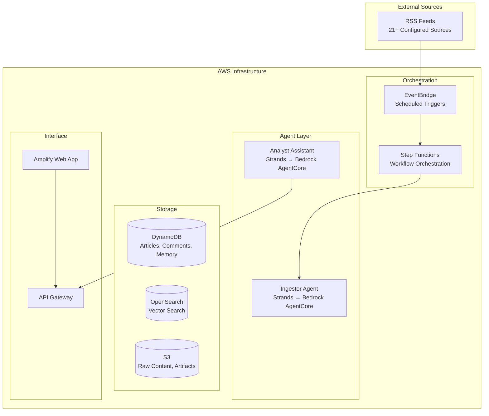

# Sentinel Cybersecurity Triage System

Sentinel is an AWS-native, multi-agent cybersecurity news triage and publishing system that autonomously ingests, processes, and publishes cybersecurity intelligence from RSS feeds and news sources. The system reduces analyst workload by automatically deduplicating content, extracting relevant entities, and intelligently routing items for human review or auto-publication.

## 🏗️ Architecture Overview



## 🚀 Key Features

- **Automated Content Ingestion**: Monitors 21+ RSS feeds from government agencies, security vendors, and news sources
- **Intelligent Relevance Assessment**: LLM-powered analysis with keyword targeting for your technology stack
- **Advanced Configuration Management**: Validated YAML configuration with hot-reloading and comprehensive error checking
- **Smart Keyword Matching**: Exact and fuzzy matching with confidence scoring and context extraction
- **Advanced Deduplication**: Multi-layered approach combining heuristic and semantic methods
- **Human-in-the-Loop Workflow**: Smart escalation with review queues and approval workflows
- **Natural Language Queries**: Chat interface for analysts to query the intelligence database
- **Comprehensive Reporting**: XLSX export with keyword analysis and hit counts
- **Multi-Agent Architecture**: Built with Strands and deployed to AWS Bedrock AgentCore

## 📋 Prerequisites

- **AWS Account** with appropriate permissions
- **Python 3.9+** for local development
- **Terraform 1.5+** for infrastructure deployment
- **Node.js 18+** (for Amplify web application)
- **AWS CLI** configured with credentials

## 🛠️ Quick Start

### 1. Clone and Setup

```bash
git clone <repository-url>
cd sentinel-cybersecurity-triage

# Set up Python virtual environment
./scripts/setup_venv.sh
source venv/bin/activate

# Copy environment configuration
cp .env.example .env
# Edit .env with your AWS account details
```

### 2. Bootstrap Terraform State

```bash
cd infra/bootstrap
terraform init
terraform apply

# Note the outputs for backend configuration
```

### 3. Configure Backend

```bash
cd ../
# Configure backend with outputs from bootstrap
terraform init -backend-config="bucket=<state-bucket-name>" \
               -backend-config="dynamodb_table=<locks-table-name>"
```

### 4. Deploy Infrastructure

```bash
# Development environment
cd envs/dev
terraform init
terraform plan -var-file="terraform.tfvars"
terraform apply -var-file="terraform.tfvars"

# Production environment (when ready)
cd ../prod
terraform init
terraform plan -var-file="terraform.tfvars"
terraform apply -var-file="terraform.tfvars"
```

### 5. Configure RSS Feeds and Keywords

Update the configuration files with your specific requirements:

- `config/feeds.yaml` - RSS feed sources and categories
- `config/keywords.yaml` - Target keywords for your technology stack
- `config/feature_flags.yaml` - Feature toggles for gradual rollout

**Test Configuration Loading:**

```bash
# Test the configuration system
python3 -c "
from src.shared.config_loader import FeedConfigLoader, KeywordManager

# Test feed configuration
feed_loader = FeedConfigLoader()
config = feed_loader.load_config()
print(f'✓ Loaded {len(config.feeds)} RSS feeds')

# Test keyword configuration  
keyword_manager = KeywordManager()
keyword_config = keyword_manager.load_config()
keywords = keyword_manager.get_all_keywords()
print(f'✓ Loaded {len(keywords)} keywords with fuzzy matching')

# Test keyword matching
sample_text = 'Microsoft Azure vulnerability affects Office 365 users'
matches = keyword_manager.match_keywords(sample_text)
print(f'✓ Found {len(matches)} keyword matches in sample text')
"
```

## 📁 Project Structure

```
sentinel-cybersecurity-triage/
├── infra/                          # Terraform infrastructure
│   ├── modules/                    # Reusable Terraform modules
│   ├── envs/                       # Environment-specific configurations
│   │   ├── dev/                    # Development environment
│   │   └── prod/                   # Production environment
│   ├── bootstrap/                  # Terraform state backend setup
│   └── *.tf                        # Main Terraform configuration
├── src/                            # Source code
│   ├── lambda_tools/               # Lambda function implementations
│   └── shared/                     # Shared utilities and data models
│       ├── __init__.py             # Package initialization
│       ├── models.py               # Pydantic data models and schemas
│       ├── config.py               # Configuration constants and settings
│       ├── config_loader.py        # Configuration loaders with validation
│       └── keyword_manager.py      # Keyword matching and management
├── config/                         # Configuration files
│   ├── feeds.yaml                  # RSS feed configuration
│   ├── keywords.yaml               # Target keywords configuration
│   └── feature_flags.yaml          # Feature flags for rollout
├── tests/                          # Test files
├── scripts/                        # Deployment and utility scripts
├── docs/                           # Documentation
└── requirements.txt                # Python dependencies
```

## 🔧 Configuration

The system uses a comprehensive configuration management system with validation and hot-reloading capabilities.

### RSS Feeds Configuration

The system monitors 21+ RSS feeds from government agencies, security vendors, and news sources. Feed configuration is managed through `config/feeds.yaml` with full validation and categorization.

**Supported Feed Categories:**
- **Advisories**: Official security advisories from government agencies
- **Alerts**: Urgent security alerts and warnings  
- **Vulnerabilities**: CVE disclosures and vulnerability information
- **Vendor**: Security updates from technology vendors
- **Threat Intel**: Threat intelligence and analysis reports
- **Research**: Security research and technical analysis
- **News**: General cybersecurity news and updates
- **Data Breach**: Data breach notifications and reports
- **Policy**: Cybersecurity policy and regulatory updates

**Example Feed Configuration:**

```yaml
feeds:
  - name: "CISA Known Exploited Vulnerabilities"
    url: "https://www.cisa.gov/sites/default/files/feeds/known_exploited_vulnerabilities.xml"
    category: "Vulnerabilities"
    enabled: true
    fetch_interval: "30m"
    description: "CISA KEV catalog feed"

  - name: "Microsoft Security Response Center"
    url: "https://msrc.microsoft.com/blog/feed"
    category: "Vendor"
    enabled: true
    fetch_interval: "2h"
    description: "Microsoft security updates and advisories"
```

**Feed Management Features:**
- URL format validation (HTTP/HTTPS only)
- Fetch interval validation (supports s/m/h/d units)
- Category validation against predefined enums
- Duplicate feed name detection
- Enable/disable individual feeds
- Automatic configuration reloading

### Target Keywords Configuration

The keyword management system provides intelligent relevance assessment with exact and fuzzy matching capabilities. Configure your technology stack keywords in `config/keywords.yaml`.

**Keyword Categories:**
- `cloud_platforms`: Azure, AWS, Google Cloud, etc.
- `security_vendors`: Mimecast, Fortinet, CrowdStrike, etc.
- `enterprise_tools`: Jamf Pro, Tenable, CyberArk, etc.
- `enterprise_systems`: Oracle HCM, FlexCUBE, etc.
- `network_infrastructure`: Cisco devices, switches, etc.
- `virtualization`: Citrix, VMware products, etc.
- `specialized_platforms`: Custom business applications

**Example Keyword Configuration:**

```yaml
cloud_platforms:
  - keyword: "Azure"
    variations: ["Microsoft Azure", "Azure AD", "Azure Active Directory"]
    weight: 1.0
    description: "Microsoft Azure cloud platform"

security_vendors:
  - keyword: "Mimecast"
    variations: ["Mimecast Email Security"]
    weight: 1.0
    description: "Email security platform"

# Keyword matching settings
settings:
  min_confidence: 0.7
  enable_fuzzy_matching: true
  max_edit_distance: 2
  case_sensitive: false
  word_boundary_matching: true
  context_window: 10

# Priority categories for reporting
categories:
  critical: ["Azure", "Microsoft 365", "Amazon Web Services"]
  high: ["Mimecast", "Fortinet", "SentinelOne"]
  medium: ["Jamf Pro", "Tenable", "Oracle HCM"]
  low: ["Moodle", "Brevo", "TextLocal"]
```

**Keyword Matching Features:**
- **Exact Matching**: Direct keyword and variation matching
- **Fuzzy Matching**: Levenshtein distance-based similarity matching
- **Context Extraction**: Captures surrounding text for analysis
- **Confidence Scoring**: Weighted relevance scoring
- **Priority Classification**: Critical/High/Medium/Low categorization
- **Performance Optimization**: Indexed lookups for fast matching

### Configuration Management API

The system provides programmatic access to configuration through dedicated loader classes:

```python
from src.shared.config_loader import FeedConfigLoader, KeywordManager

# Load and validate feed configuration
feed_loader = FeedConfigLoader("config/feeds.yaml")
config = feed_loader.load_config()

# Get feeds by category
news_feeds = feed_loader.get_feeds_by_category(FeedCategory.NEWS)
enabled_feeds = feed_loader.get_enabled_feeds()

# Validate configuration
issues = feed_loader.validate_all_feeds()

# Load keyword configuration with fuzzy matching
keyword_manager = KeywordManager("config/keywords.yaml")
keyword_config = keyword_manager.load_config()

# Find keyword matches in text
text = "Microsoft Azure vulnerability affects Office 365 users"
matches = keyword_manager.match_keywords(text, include_fuzzy=True)

# Get keywords by priority
critical_keywords = keyword_manager.get_critical_keywords()
```

### Feature Flags

Control system capabilities with feature flags in `config/feature_flags.yaml`:

```yaml
enable_agents: false              # Start with direct Lambda orchestration
enable_amplify: false            # Enable web app when ready
enable_opensearch: false         # Enable vector search when ready
enable_auto_publish: false       # Require human review initially
```

## 🎯 Gradual Rollout Strategy

Sentinel is designed for gradual rollout with feature flags:

1. **Phase 1**: Direct Lambda orchestration (`enable_agents: false`)
2. **Phase 2**: Enable Bedrock AgentCore integration (`enable_agents: true`)
3. **Phase 3**: Enable web application (`enable_amplify: true`)
4. **Phase 4**: Enable vector search (`enable_opensearch: true`)
5. **Phase 5**: Enable auto-publishing (`enable_auto_publish: true`)

## 📊 Monitoring and Observability

- **CloudWatch Dashboards**: System metrics, ingestion rates, relevancy rates
- **X-Ray Tracing**: End-to-end request tracing with correlation IDs
- **Cost Tracking**: Daily and monthly cost monitoring with alerts
- **Performance Metrics**: Processing latency, deduplication accuracy
- **Quality Metrics**: Keyword hit rates, human review ratios

## 🔐 Security Features

- **Encryption at Rest**: KMS encryption for S3, DynamoDB, and OpenSearch
- **VPC Endpoints**: Private communication with AWS services
- **IAM Least Privilege**: Scoped permissions for each component
- **PII Detection**: Automatic detection and redaction of sensitive data
- **Audit Trails**: Complete decision traces with tool calls and rationales

## 🧪 Testing

The project includes comprehensive unit tests for configuration management and keyword matching:

```bash
# Run all tests
pytest tests/

# Run specific test modules
pytest tests/test_config_loader.py -v

# Run tests with coverage reporting
pytest --cov=src --cov-report=html tests/

# Run tests for specific functionality
pytest tests/test_config_loader.py::TestFeedConfigLoader::test_load_valid_config -v
pytest tests/test_config_loader.py::TestKeywordManager::test_find_fuzzy_matches -v

# Lint and format code
black src/ tests/
isort src/ tests/
flake8 src/ tests/
mypy src/
```

**Test Coverage Includes:**
- **Feed Configuration**: Loading, validation, URL checking, interval parsing
- **Keyword Management**: Exact matching, fuzzy matching, confidence scoring
- **Configuration Validation**: Duplicate detection, format validation, error handling
- **Edge Cases**: Invalid URLs, malformed YAML, missing files, encoding issues
- **Performance**: Levenshtein distance calculation, indexed lookups

## 📚 Documentation

- [Requirements Document](.kiro/specs/sentinel-cybersecurity-triage/requirements.md)
- [Design Document](.kiro/specs/sentinel-cybersecurity-triage/design.md)
- [Implementation Tasks](.kiro/specs/sentinel-cybersecurity-triage/tasks.md)
- [Configuration Examples](docs/configuration_examples.md) - Comprehensive examples of using the configuration system
- [API Documentation](docs/api.md)
- [Deployment Guide](docs/deployment.md)
- [Operations Runbook](docs/operations.md)

## 🤝 Contributing

1. Fork the repository
2. Create a feature branch (`git checkout -b feature/amazing-feature`)
3. Commit your changes (`git commit -m 'Add amazing feature'`)
4. Push to the branch (`git push origin feature/amazing-feature`)
5. Open a Pull Request

## 📄 License

This project is licensed under the MIT License - see the [LICENSE](LICENSE) file for details.

## 🆘 Support

For support and questions:

- Create an issue in the repository
- Contact the security team at security-team@company.com
- Check the [troubleshooting guide](docs/troubleshooting.md)

## 🏷️ Version

Current version: 0.1.0

See [CHANGELOG.md](CHANGELOG.md) for version history and updates.